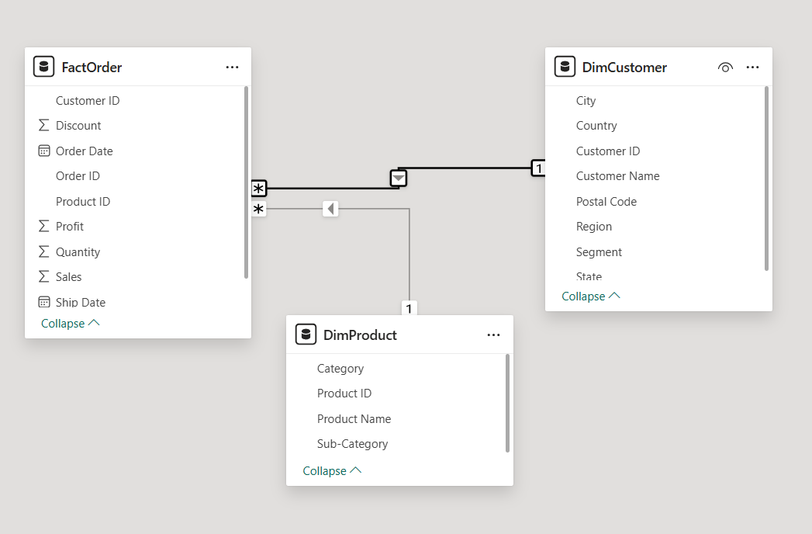

# Mini Date Pipeline Project

This was a quick data pipeline project to practice ETL (extracting, transforming, and loading) data.
I used the sample data from https://www.kaggle.com/datasets/ishanshrivastava28/superstore-sales, which provides a mock dataset regarding sales from a large store. I extracted and transformed the data such that it would fit the star schema model (relating dimensions to facts). Dimension tables describe business entities, while fact tables store observations or events. This resulted in transforming the data into three tables, FactOrder (table of orders), DimCustomer (table of customers), and DimProduct (table of products). This data was loaded into their respective csv files.

The csv files were then loaded into Microsoft Power BI, where I then created a quick dashboard focusing on evaluating the profits. The dashboard shows the profit by month, the top 10 most profitable products, the total overall profit from the data, and the states in which the customers reside.

This image shows the relationship between the tables (DimCustomer and DimProduct each have a one-to-many relationship with FactOrder).

This is an image of the dashboard I created in Power BI.

